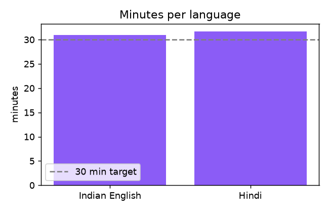
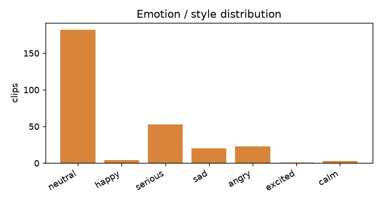
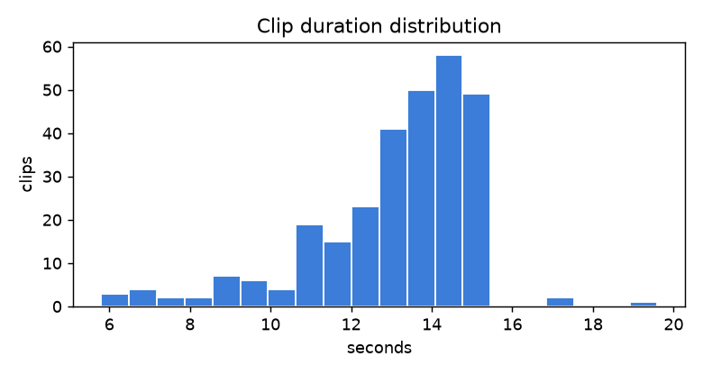
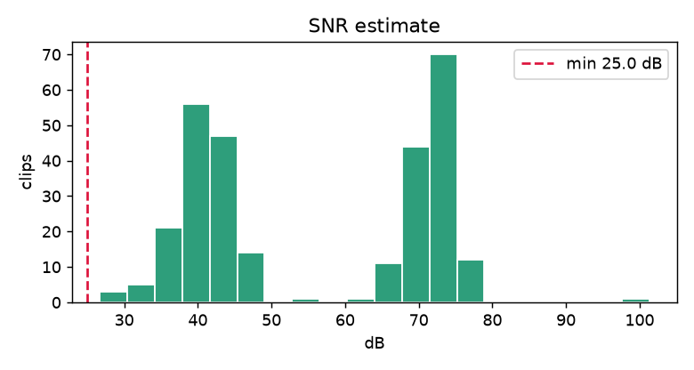

<div align="center">

# 🎙️ Vaani

**A curated Indian-English + Hindi speech corpus for expressive Text-to-Speech**

[](https://huggingface.co/datasets/ghostieee11/vaani-speech-corpus)
[](LICENSE)
[](requirements.txt)
[](https://docs.sarvam.ai)

*~62 minutes · 285 single-speaker clips · 2 real Indian voices · human-verified transcripts and emotion tags*

[**📦 Get the dataset**](https://huggingface.co/datasets/ghostieee11/vaani-speech-corpus) &nbsp;·&nbsp; [**🔎 Curation log**](curation_log.md) &nbsp;·&nbsp; [**⚙️ Pipeline**](#%EF%B8%8F-how-it-works)

</div>

---

> **This is a data-curation project, not a pipeline demo.** The scripts are deliberately simple. The value is in the judgment: every clip was listened to, every transcript human-corrected, every tag confirmed by ear, and every keep/cut decision is recorded in [`curation_log.md`](curation_log.md). The tools (Sarvam ASR / diarization / LLM, Silero-VAD, ffmpeg) assist; they do not decide.

## 📊 At a glance

| Split | Clips | Minutes | Speaker | Source |
|:--|:--:|:--:|:--|:--|
| 🎓 **Indian English** | 146 | 30.7 | Prof. H.C. Verma | physics lectures |
| 📖 **Hindi** | 139 | 31.6 | Kahani Suno | Premchand narration |
| **Total** | **285** | **~62** | one voice per language | YouTube |

## 🎯 Quality targets (and why)

| Target | Value | Rationale |
|:--|:--|:--|
| Sample rate | 24 kHz mono, 16-bit WAV | modern neural-TTS standard (LibriTTS-R) |
| Loudness | -23 LUFS, peak <= -1 dBFS | EBU R128, consistent level, no clipping |
| SNR | >= 25 dB | IndicVoices-R quality bar |
| Bandwidth | >= 4 kHz HF edge | reject telephone-grade band-limiting |
| Clip length | 4 to 20 s, sentence-bounded | standard TTS range, cut on silence |
| Speakers | one voice per language | coherent single-speaker corpus |
| Transcripts | verbatim + normalized | human-corrected from Sarvam ASR drafts |
| Emotion | 8-tag taxonomy, by ear | `neutral, happy, excited, sad, angry, serious, calm, whisper` |
| Sourcing | YouTube, real Indian speakers | quality over CC, provenance logged |

All thresholds live in [`src/config.py`](src/config.py).

## 📈 Dataset profile

<p align="center">


<br/>


</p>

## ⚙️ How it works

```
sources.csv  (human sourcing decision)
   |  01_download         yt-dlp (+aria2c) acquire YouTube audio
   v  02_preprocess       ffmpeg -> 24 kHz mono, trim to clip_range
   |  03_verify_speaker   Sarvam diarization: confirm single-speaker
   v  04_segment          Silero-VAD -> 4 to 20 s clips, loudness-normalized
   |  05_transcribe       Sarvam ASR (saaras:v3) -> draft transcripts
   v  06_prefill_review   Sarvam LLM -> normalized text + emotion suggestions
   |
   +==  HUMAN PASS   listen to every clip, fix transcripts, confirm emotion,
   |                 drop bad clips  (review.html + review_sheet.csv)
   v  07_qc               audio metrics + gates (SNR / loudness / peak / bandwidth)
   |  08_build_dataset    package + dataset card + push to HuggingFace
```

## 🗣️ Sarvam APIs used

| Capability | Call | Used for |
|:--|:--|:--|
| **ASR** | `speech_to_text.transcribe(model="saaras:v3")` | per-clip transcript drafts |
| **Diarization** | `speech_to_text_job.create_job(with_diarization=True)` | single-speaker verification |
| **LLM** | `chat.completions(model="sarvam-30b")` | text normalization + emotion tags |

All wrapped in [`src/sarvam_client.py`](src/sarvam_client.py) with retries, backoff, and on-disk response caching (reruns do not re-bill).

## 🧠 Curation highlights

A few calls that made the difference (full detail in [`curation_log.md`](curation_log.md)):

- **Do not trust the diarizer.** Sarvam flagged both narrators as "2 speakers." Reading the diarized transcript showed a single reader doing character voices and rhetorical questions; on the full sources the dominant speaker is **94 to 98%**. We kept them.
- **Avoided the AI-voice trap.** Many English "audiobook / learn-English" channels use synthetic narration. Training TTS on TTS output is a silent quality killer, so we chose real, known Indian speakers.
- **Music beds hide in produced talks.** A VAD speech-vs-pause RMS check (clean = 30 to 66 dB gap, music bed < 18 dB) rejected polished but scored sources.
- **Fixed ASR drift.** The narrator's name came back as 8 spellings (रग्गू, रग्घु, ...); corrected to **रघु** across 61 clips, with the raw ASR preserved for audit.

## 🚀 Quickstart

```bash
python3 -m venv .venv && source .venv/bin/activate
pip install -r requirements.txt
brew install ffmpeg
cp .env.example .env            # add SARVAM_API_KEY + HF_TOKEN

# curate sources.csv, then:
python src/01_download.py
python src/02_preprocess.py
python src/03_verify_speaker.py
python src/04_segment.py
python src/05_transcribe.py
python src/06_prefill_review.py
python src/make_review_html.py  # open review.html, listen, curate review_sheet.csv
python src/07_qc.py
python src/08_build_dataset.py  # package + push to HuggingFace
```

## 📁 Repo structure

```
src/              pipeline (01-08) + sarvam_client, utils, config, make_review_html
sources.csv       accepted sources (url, creator, license), human-curated
curation_log.md   running log of human curation decisions
review_sheet.csv  per-clip human edits (generated, then curated)
reports/          qc_report.csv, diarization_report.csv, figures/
data/             gitignored: raw, processed, clips, hf_export
```

## 📄 License

Code: **MIT**. Dataset: research / educational use. Audio is YouTube-sourced (not Creative Commons); per-clip `source_url` and `license` provenance live in the dataset metadata, and no ownership is claimed.

<div align="center">
<sub>Dataset: <a href="https://huggingface.co/datasets/ghostieee11/vaani-speech-corpus">ghostieee11/vaani-speech-corpus</a></sub>
</div>
